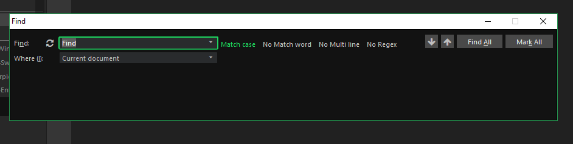
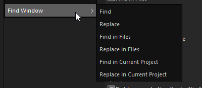
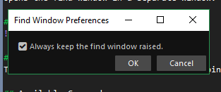

# Find-Window
Opens the find window in a separate window.

## Screenshot
  
*Noticed there where some complains about the new find icons, so I replaced them by text buttons*

## Key Bindings
This addon will replaces the default key bindings, so you don't have to configure any key bindings.

## Available Commands
All the Availible commands are:  
* Find
* Replace
* Find in Files
* Replace in Files
* Find in Current Project
* Replace in Current Project

Also all these command are also available through the tools menu:

## Settings
By default the Find Window is always raised, meaning the find window will always be on top of Komodo.  
If you don't like this behavior, you can disable this through the settings.  
**Addons > Find Window > Options**

